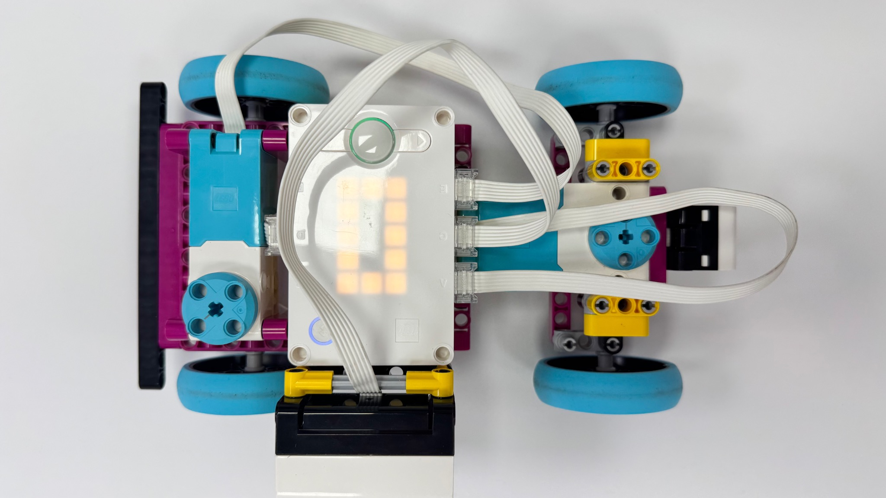
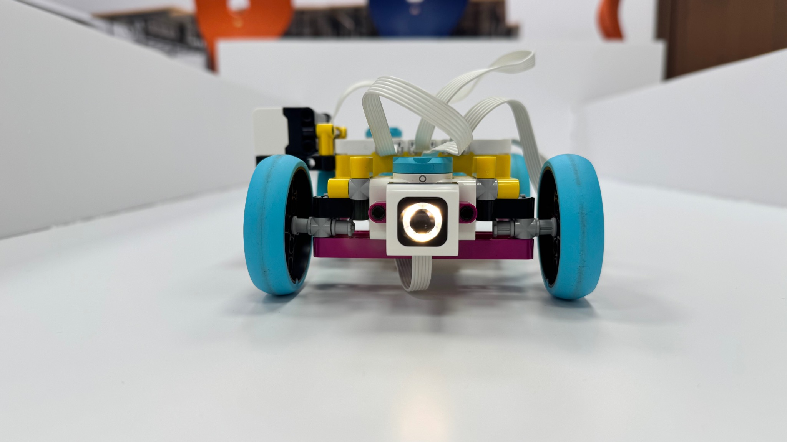
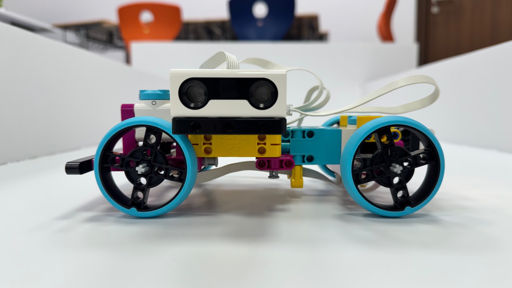
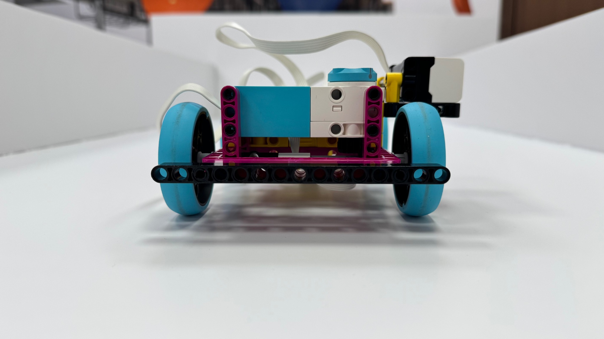
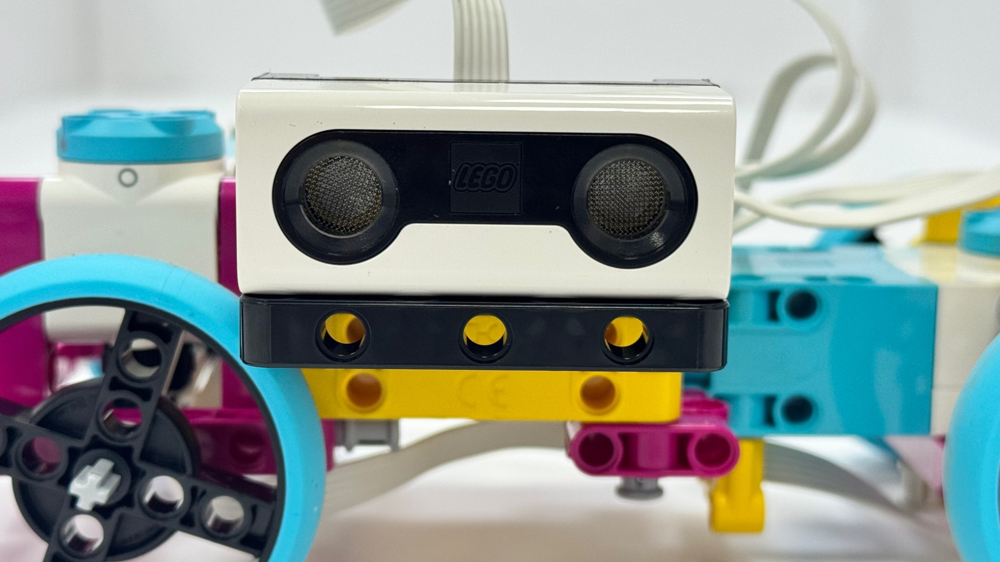
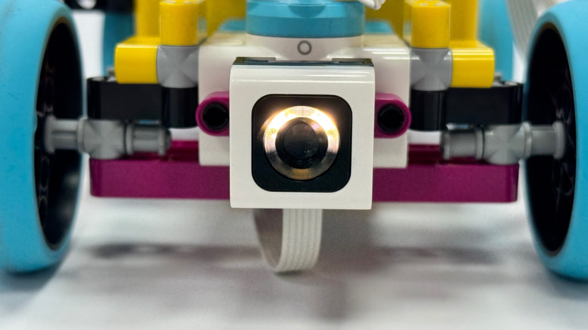
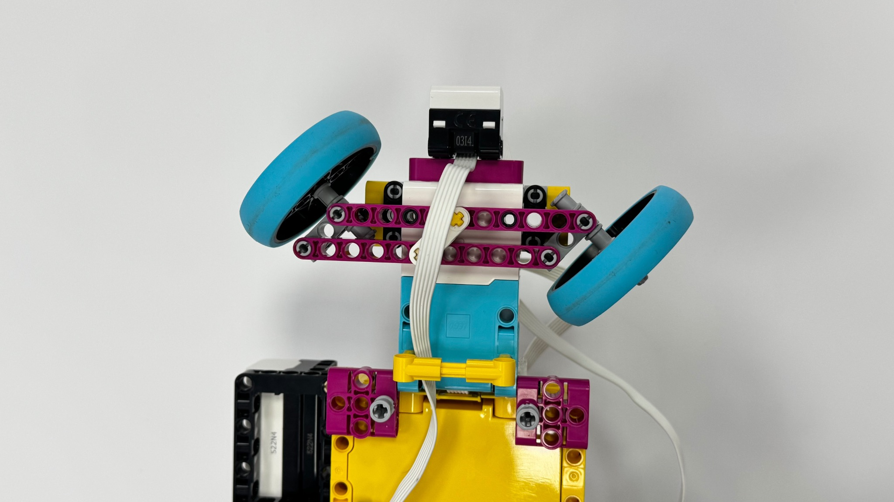
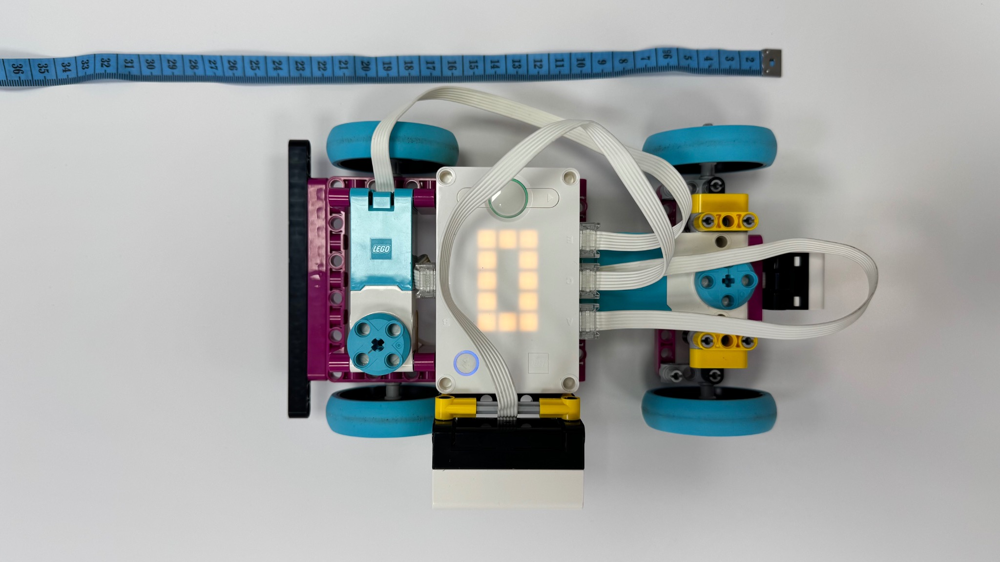
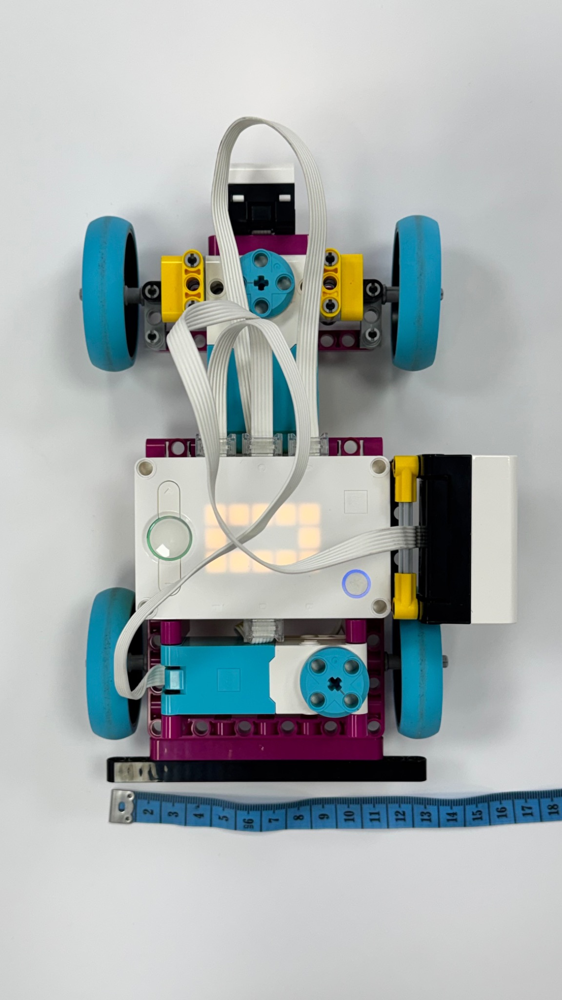
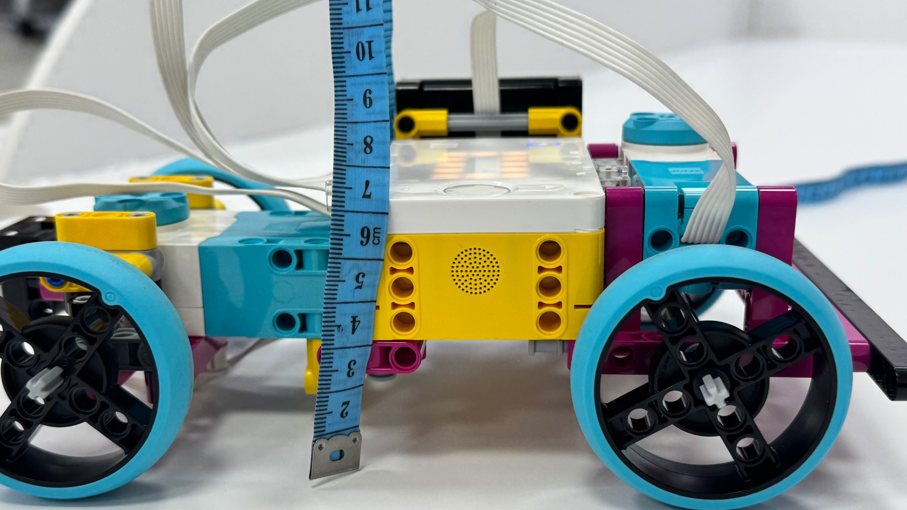

# WRO 2026 Robot

## Project Overview

This project was developed for **WRO 2026** using the **LEGO SPIKE Prime** platform.

The robot is designed to autonomously navigate the competition field using a mechanical steering system, a Distance Sensor, and a Color Sensor.

During the run, the robot can:

- Exit the starting parking position
- Detect and approach the first wall
- Align itself parallel to the wall
- Follow walls using the Distance Sensor
- Detect when a wall ends
- Perform controlled left corners
- Detect red and green field elements
- Perform obstacle avoidance
- Complete seven corners
- Return to the parking area at the end of the run

The robot was developed through repeated physical testing and calibration to improve steering accuracy, wall detection, cornering, obstacle avoidance, and parking.

---

# Robot Design

## Top View



The top view shows the complete arrangement of the SPIKE Prime Hub, motors, wheels, sensors, frame, and wiring.

---

## Front View



The front section contains the steering mechanism and the Color Sensor.

---

## Side View



The side view shows the wheel arrangement and the side-mounted Distance Sensor.

---

## Rear View



The rear section contains the drive system and the main supporting frame.

---

# Hardware Configuration

| Port | Component | Function |
|---|---|---|
| A | Steering Motor | Controls the front steering system |
| B | Color Sensor | Detects red and green field elements |
| C | Distance Sensor | Detects walls and measures wall distance |
| E | Rear Drive Motor | Controls forward and reverse movement |

---

# Sensors

## Distance Sensor

The Distance Sensor is connected to **Port C**.



The Distance Sensor is used to:

- Detect the first wall
- Measure the distance between the robot and the wall
- Help align the robot parallel to the wall
- Maintain an appropriate wall-following distance
- Detect when the current wall ends
- Detect a new wall after completing a corner

During sensor calibration:

```text
14 cm actual distance ≈ 140 mm sensor reading
```

The main normal wall-following values are:

```python
MIN_DISTANCE = 150
MAX_DISTANCE = 250
WALL_LOST_DISTANCE = 450
```

This means that during normal navigation, the robot attempts to remain approximately **15–25 cm away from the wall**.

---

## Color Sensor

The Color Sensor is connected to **Port B**.



The Color Sensor is used to detect:

- Red field elements
- Green field elements

Both colors activate the obstacle avoidance routine.

When a target color is detected, the robot:

1. Stops its normal movement.
2. Recenters the steering.
3. Reverses away from the obstacle.
4. Turns to the right.
5. Moves around the colored element.
6. Returns the steering by the same amount.
7. Recenters.
8. Moves forward to clear the obstacle.
9. Continues the navigation sequence.

Main obstacle avoidance values:

```python
COLOR_REVERSE_CM = 10

COLOR_RIGHT_STEP = 55
COLOR_RIGHT_DRIVE_CM = 5
COLOR_RIGHT_STEPS = 3

COLOR_CLEAR_CM = 10
```

---

# Steering Mechanism

The steering motor is connected to **Port A**.

The robot uses a mechanical front-wheel steering system rather than differential steering.



The steering system was manually calibrated through repeated physical testing.

The original straight value was:

```python
STRAIGHT = 0
```

During testing, the robot slightly drifted when using this value.

The final calibrated value became:

```python
STRAIGHT = -2
```

This setting produces a more stable straight path for the current mechanical design.

---

# Parking Exit

The robot begins the competition run inside the parking area.

The parking exit was tested independently before being integrated into the complete navigation program.

The robot exits using a controlled **left steering sequence**.

Main settings:

```python
EXIT_STEER = -55

EXIT_SHORT_DEGREES = 140
EXIT_LONG_DEGREES = 380
```

The exit sequence is:

1. Recenter the steering.
2. Turn left.
3. Move forward a short distance.
4. Increase the left steering angle.
5. Continue moving out of the parking area.
6. Reduce the steering angle.
7. Move forward again.
8. Recenter the steering.

---

# First Wall Approach

After leaving the parking position, the robot begins approaching the first wall.

The initial forward movement is:

```python
FIRST_STRAIGHT_CM = 26
FIRST_STRAIGHT_SPEED = 400

APPROACH_DISTANCE_SCALE = 2.0
```

After the initial movement, the robot gradually changes its steering angle while searching for the wall.

The search angles are:

```python
FIRST_SEARCH_ANGLES = (
    -5,
    -10,
    -15,
    -20,
    -24,
    -25
)
```

Using several small steering adjustments instead of one large turn allows the robot to approach the first wall more smoothly.

---

# First Wall Detection

The first time the Distance Sensor detects the wall is considered the **beginning of the first wall**, not a corner.

The robot must first align its body before starting normal wall following.

This prevents the robot from driving directly toward the wall when its steering wheels are straight but the robot body itself is still angled.

---

# First Wall Alignment

The robot checks whether it is approximately parallel to the first wall.

The alignment process works as follows:

1. Measure the current wall distance.
2. Move forward a small test distance.
3. Measure the wall distance again.
4. Calculate the difference between the two readings.
5. Determine whether the robot is moving toward or away from the wall.
6. Apply a small steering correction.
7. Repeat until the robot is approximately parallel.

The main alignment tolerance is:

```python
ALIGN_TOLERANCE = 15
```

---

# Wall Following

After alignment, the robot begins following the first wall.

The main first-wall distance range is:

```python
FIRST_WALL_MIN_DISTANCE = 150
FIRST_WALL_MAX_DISTANCE = 300
```

The robot reacts differently depending on the sensor reading:

- **Too close:** gently steers away from the wall
- **Correct distance:** continues approximately straight
- **Too far:** gently steers toward the wall

The robot does not immediately assume the wall has ended after one missing sensor reading.

It requires several consecutive lost readings:

```python
FIRST_WALL_LOST_COUNT = 10
```

This helps prevent false corner detection.

---

# Normal Wall Following

After the first corner, the robot uses the normal wall-following routine.

Important settings include:

```python
MIN_DISTANCE = 150
MAX_DISTANCE = 250

WALL_LOST_DISTANCE = 450

LOST_COUNT_NEEDED = 8
WALL_LOCK_COUNT_NEEDED = 5
```

The robot first confirms that it has detected the current wall before depending on it for navigation.

When the wall disappears for enough consecutive sensor readings, the robot begins its next corner.

---

# Corner Strategy

The robot performs controlled **left corners**.

The main corner values are:

```python
CORNER_STEP = -55
LAST_CORNER_STEP = -80

CORNER_STEP_DISTANCE_CM = 8

CORNER_SPEED = 500
STEERING_SPEED = 470
RECENTER_SPEED = 670
```

The corner sequence is:

1. Turn left by 55 and move approximately 8 cm.
2. Turn left by another 55 and move approximately 8 cm.
3. Turn left by another 55 and move approximately 8 cm.
4. Apply the final larger steering step of 80 and move approximately 8 cm.
5. Continue searching for the next wall.
6. Confirm the new wall with the Distance Sensor.
7. Recenter the steering.

The program also includes a corner safety value:

```python
CORNER_TOO_CLOSE = 90
```

If the robot becomes too close to a wall during the corner, the movement can be stopped to reduce the risk of collision.

---

# Seven-Corner Navigation

The complete navigation program is currently configured for:

```python
CORNERS_TO_RUN = 7
```

The first wall uses its own detection and alignment routine.

After Corner 1, the robot repeatedly performs:

```text
Follow Wall
     ↓
Detect Wall End
     ↓
Turn Left
     ↓
Detect New Wall
     ↓
Continue
```

The sequence continues until Corner 7 is completed.

---

# Return to Parking

After completing the seventh corner, the robot begins the return-to-parking routine.

This routine was developed separately through physical testing and later integrated into the full competition program.

The current return sequence is:

1. Turn right and move approximately 45 cm.
2. Recenter and move straight approximately 10 cm.
3. Perform three left steering movements.
4. Recenter and move straight approximately 15 cm.
5. Begin reversing toward the parking area.
6. Reverse with right steering at 35 for approximately 10 cm.
7. Increase the right steering to 40 and reverse approximately 10 cm.
8. Increase the right steering to 50 and reverse approximately 20 cm.
9. Recenter the steering.
10. Move forward approximately 2 cm for final positioning.
11. Reverse straight approximately 15 cm.
12. Stop in the parking area.

Main return settings:

```python
RETURN_RIGHT_STEER = 35
RETURN_RIGHT_DRIVE_CM = 45

RETURN_STRAIGHT_AFTER_RIGHT_CM = 10

RETURN_LEFT_STEP = -55
RETURN_LEFT_STEP_DRIVE_CM = 8

RETURN_STRAIGHT_AFTER_LEFT_CM = 15

RETURN_REVERSE_RIGHT_1_STEER = 35
RETURN_REVERSE_RIGHT_1_CM = 10

RETURN_REVERSE_RIGHT_2_STEER = 40
RETURN_REVERSE_RIGHT_2_CM = 10

RETURN_REVERSE_RIGHT_3_STEER = 50
RETURN_REVERSE_RIGHT_3_CM = 20

RETURN_FINAL_FORWARD_CM = 2
RETURN_FINAL_REVERSE_CM = 15
```

---

# Robot Dimensions

The final robot dimensions were measured physically after completing the mechanical assembly.

## Length



---

## Width



---

## Height



These photographs document the real measurements of the completed robot.

---

# Program Flow

The complete competition program follows this general sequence:

```text
START
  |
  v
Exit Parking
  |
  v
Approach First Wall
  |
  v
Detect First Wall
  |
  v
Align Parallel to Wall
  |
  v
Follow First Wall
  |
  v
Detect Wall End
  |
  v
Corner 1
  |
  v
Follow Wall
  |
  v
Detect Wall End
  |
  v
Next Corner
  |
  v
Repeat Until Corner 7
  |
  v
Return to Parking
  |
  v
Final Parking Position
  |
  v
STOP
```

The Color Sensor operates during navigation and activates the obstacle avoidance routine when a red or green field element is detected.

---

# Software

The robot is programmed using Python for the LEGO SPIKE Prime platform.

The main robot program contains:

- Steering calibration
- Parking exit
- Distance Sensor reading
- First-wall detection
- First-wall alignment
- Wall following
- Wall-loss detection
- Corner navigation
- Color detection
- Obstacle avoidance
- Seven-corner navigation
- Return-to-parking routine

---

# Repository Structure

The GitHub repository is organized as follows:

```text
WRO-2026-Robot/
│
├── README.md
├── code
│
├── documentation/
├── tests/
│
└── images/
    ├── robot_top.jpg
    ├── robot_front.jpg
    ├── robot_side.jpg
    ├── robot_rear.jpg
    ├── distance_sensor.jpg
    ├── color_sensor.jpg
    ├── steering_mechanism.jpg
    ├── robot_length.jpg
    ├── robot_width.jpg
    └── robot_height.jpg
```

---

# Testing and Calibration

The robot was developed through repeated physical testing.

Important development decisions included:

- Adjusting the straight steering value from `0` to `-2`
- Testing the parking exit independently
- Gradually approaching the first wall
- Aligning the robot body before wall following
- Requiring multiple sensor readings before confirming a wall
- Using several steering movements to complete corners
- Adding safety checks during cornering
- Testing red and green detection
- Developing obstacle avoidance
- Testing the return-to-parking routine separately
- Integrating all functions into the final competition sequence

---

# Documentation

Additional project documentation includes:

- Mechanical design
- Hardware configuration
- Wiring and port configuration
- Sensor placement
- Steering mechanism
- Robot dimensions
- Sensor calibration
- Engineering decisions
- Program flow
- Testing and iteration
- Risk and failure analysis
- Performance verification

---

# Current Project Status

The current robot program contains the complete planned competition sequence:

- Starting parking exit
- First-wall detection
- Wall alignment
- Distance-based wall following
- Seven controlled corners
- Red and green detection
- Obstacle avoidance
- Return to parking

Final physical testing on the competition field is used to confirm that the calibrated steering values and distances remain accurate under final competition conditions.

---

## WRO 2026

**Platform:** LEGO SPIKE Prime  
**Programming Language:** Python  
**Navigation:** Distance Sensor + mechanical steering  
**Color Detection:** Color Sensor  
**Competition:** WRO 2026
